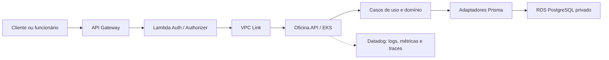

# Oficina API

API principal do sistema de oficina mecânica. Gerencia clientes, veículos, catálogo, estoque, ordens de serviço, orçamentos e métricas, com regras de negócio separadas da infraestrutura HTTP e da persistência.

## O que este repositório entrega

- API REST em Node.js/TypeScript e Express;
- domínios de clientes, catálogo, estoque, atendimento e orçamento;
- persistência PostgreSQL via Prisma e migrations versionadas;
- Swagger/OpenAPI e health check;
- autenticação administrativa legada e consumo do JWT validado no Gateway;
- logs JSON, correlation ID, métricas de negócio e Datadog APM;
- imagem Docker segura para EKS;
- testes unitários/integrados e pipelines CI/CD;
- documentação central, RFCs, ADRs e diagramas da Fase 3.



## Documentação

### Entrega da Fase 3

- [Visão completa da entrega, objetivos e arquitetura integrada](docs/fase3/entrega-tecnica.md)
- [Matriz de conformidade com todos os requisitos oficiais](docs/fase3/matriz-conformidade.md)
- [Catálogo de evidências executadas e rastreabilidade no código](docs/fase3/catalogo-evidencias.md)
- [Guia de demonstração e aceite](docs/fase3/guia-demonstracao-e-aceite.md)
- [Índice de RFCs, ADRs e documentação](docs/fase3/README.md)
- [Arquitetura-alvo e diagramas de sequência](docs/fase3/arquitetura-alvo.md)
- [Matriz de rotas e permissões](docs/fase3/matriz-rotas-permissoes.md)
- [Modelo de dados](docs/fase3/modelo-dados.md)
- [Segurança](docs/fase3/seguranca.md)
- [Observabilidade](docs/fase3/observabilidade.md)
- [Runbook e rollback](docs/fase3/runbook.md)
- [Estimativa de custos](docs/fase3/estimativa-custos.md)
- [Roteiro do vídeo final](docs/fase3/roteiro-video-final.md)
- [Documento-base da entrega final](docs/fase3/entrega-final.md)

### Referência da API

- [Visão geral funcional](docs/visao-geral.md)
- [APIs e fluxos](docs/apis.md)
- [Arquitetura interna](docs/arquitetura.md)
- [Decisões arquiteturais anteriores](docs/decisoes-arquiteturais.md)
- [Linguagem ubíqua e DDD](docs/Linguagem-Ubiqua-DDD.md)
- [CI/CD](docs/ci-cd.md)
- [Infraestrutura](docs/infraestrutura.md)

Repositórios relacionados: [autenticação](https://github.com/maypinheiro/oficina-auth-function), [Kubernetes](https://github.com/maypinheiro/oficina-k8s-infra) e [banco](https://github.com/maypinheiro/oficina-database-infra).

## Tecnologias

Node.js 22, TypeScript, Express, Prisma, PostgreSQL, Jest, ESLint, Swagger/OpenAPI, Docker, Kubernetes, Datadog e GitHub Actions.

## Execução local

```bash
npm ci
docker compose up -d postgres
npm run prisma:generate
npm run prisma:migrate
npm run db:seed
npm run dev
```

API: <http://localhost:3000>. Swagger: <http://localhost:3000/docs>. Health check: <http://localhost:3000/health>.

Copie `.env.example` para `.env`. Segredos reais, credenciais, CPF e JWT nunca devem ser commitados ou registrados em logs.

## Qualidade

```bash
npm run lint
npm run typecheck
npm run test:coverage
npm run test:integration
npm run build
npm audit --audit-level=high
```

## Endpoints e segurança

- `/health`, `/docs`, autenticação e `/public/*`: públicos;
- `/clientes`, `/veiculos`, `/servicos`, `/pecas`, `/estoque`, `/ordens-servico`, `/orcamentos` e `/metricas`: protegidos pelo Gateway;
- o fluxo administrativo legado permanece separado do JWT de clientes.

Consulte a [matriz completa](docs/fase3/matriz-rotas-permissoes.md) e o Swagger.

## CI/CD e rollback

CI valida lint, tipos, testes, cobertura, integração, segurança, build e IaC. CD publica imagem imutável no ECR, executa migration controlada, seed idempotente em `hml`, rollout no EKS e smoke tests. Rollback usa o SHA da última imagem saudável; migrations seguem expand/contract e não são revertidas automaticamente.

### Como executar o deploy

1. Confirme que rede/EKS e RDS do ambiente já existem.
2. No GitHub, abra **Actions → Deploy API → Run workflow**.
3. Escolha `hml` ou `prod`; em produção, aguarde a aprovação do environment.
4. Acompanhe build/push no ECR, migration, rollout, seed de `hml`, smoke test e publicação dos outputs.
5. Use o SHA imutável e o artefato da execução como evidência/rollback.

O CD é disparado automaticamente por `workflow_run` após o CI bem-sucedido de `homolog` ou `main`, mapeando respectivamente os GitHub Environments `hml` e `prod`. O `workflow_dispatch` permanece disponível como contingência, e produção conserva sua aprovação obrigatória. A [auditoria dos requisitos](docs/fase3/matriz-conformidade.md) registra a rastreabilidade completa.

## Ambiente validado

- Conta acadêmica: `982623100545`;
- região: `us-east-1`;
- API Gateway `hml`: <https://9o7vnq3io0.execute-api.us-east-1.amazonaws.com>;
- Swagger `hml`: <https://9o7vnq3io0.execute-api.us-east-1.amazonaws.com/docs>;
- evidência do fluxo protegido: <https://github.com/maypinheiro/oficina-auth-function/actions/runs/34617351925>.
- dashboards: [API](https://app.datadoghq.com/dashboard/uhc-x7j-d3i), [Kubernetes](https://app.datadoghq.com/dashboard/cfp-bd3-ayn) e [Negócio](https://app.datadoghq.com/dashboard/i9b-paf-7z5).

O endpoint depende de uma sessão ativa do AWS Academy Learner Lab. Produção está codificada e separada, mas sua criação depende das permissões e do orçamento acadêmico.
