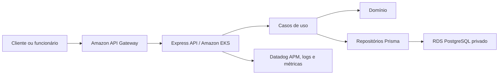

# Oficina API

API principal da oficina mecânica, responsável por clientes, veículos, catálogo, estoque, ordens de serviço, orçamentos e métricas. É executada no Amazon EKS e persiste dados no Amazon RDS PostgreSQL.

## Arquitetura



Documentação completa: [docs/fase3](docs/fase3/README.md). Repositórios relacionados: [autenticação](https://github.com/maypinheiro/oficina-auth-function), [Kubernetes](https://github.com/maypinheiro/oficina-k8s-infra) e [banco](https://github.com/maypinheiro/oficina-database-infra).

## Tecnologias

Node.js 22, TypeScript, Express, Prisma, PostgreSQL, Jest, ESLint, Swagger/OpenAPI, Docker, Kubernetes, Datadog e GitHub Actions.

## Pré-requisitos

- Node.js 22 e npm;
- Docker com Compose para PostgreSQL local;
- para cloud: AWS Academy ativa, AWS CLI, `kubectl` e acesso ao EKS.

## Execução local

```bash
npm ci
docker compose up -d postgres
npm run prisma:generate
npm run prisma:migrate
npm run db:seed
npm run dev
```

API: `http://localhost:3000`. Swagger: [http://localhost:3000/docs](http://localhost:3000/docs). Healthcheck: [http://localhost:3000/health](http://localhost:3000/health).

## Variáveis de ambiente

Copie `.env.example` para `.env`. Principais valores: `DATABASE_URL`, `PORT`, `CORS_ORIGIN`, `JWT_SECRET`, `JWT_PUBLIC_KEY_BASE64`, `JWT_ISSUER`, `JWT_AUDIENCE`, `DD_AGENT_HOST`, `DD_SERVICE`, `DD_ENV`, `DD_VERSION` e `DD_TRACE_SAMPLE_RATE`. Valores reais não devem ser commitados.

## Testes

```bash
npm run lint
npm run typecheck
npm run test:coverage
npm run test:integration
npm run build
npm audit --audit-level=high
```

## CI/CD e deploy

CI valida lint, tipos, testes, cobertura, integração, audit, build e imagem Docker. O CD manual publica imagem imutável no ECR com SHA, executa o Job de migration, faz rollout no EKS e smoke test. Use o GitHub Environment `hml` para homologação e `prod` para produção; `prod` exige aprovação.

## Rollback

Reexecute o CD com o SHA da última imagem saudável ou aplique essa imagem ao Deployment. Não reverta migrations automaticamente: confirme compatibilidade e use expand/contract. Consulte o [runbook](docs/fase3/runbook.md).

## Endpoints

- `/health`, `/docs`, `/auth/login` e `/public/*`: públicos;
- `/clientes`, `/veiculos`, `/servicos`, `/pecas`, `/estoque`, `/ordens-servico`, `/orcamentos` e `/metricas`: JWT obrigatório.

Veja a [matriz completa](docs/fase3/matriz-rotas-permissoes.md) e o Swagger local. Não há coleção Postman versionada.

## Observabilidade

Logs JSON, `x-correlation-id`, traces HTTP/PostgreSQL, métricas DogStatsD, dashboards e alertas Datadog estão implementados. Dados sensíveis são removidos pelo logger.

## Ambiente ativo e limitações

Ambiente cloud ativo: **não publicado nesta etapa**, pois as credenciais temporárias e os recursos do AWS Academy Learner Lab não estão disponíveis nesta sessão. Conta prevista: `982623100545`, região `us-east-1`. URLs do Gateway e Swagger cloud serão preenchidas após o primeiro deploy validado.
