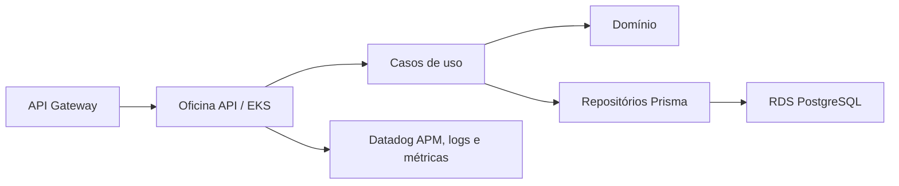

# Oficina API

Aplicação principal da oficina, executada no Amazon EKS. Este repositório contém
o domínio, casos de uso, API HTTP, Prisma, migrations, testes e imagem Docker.

## Tecnologias

- Node.js 22, TypeScript e Express;
- PostgreSQL, Prisma e migrations;
- Jest, ESLint e Swagger/OpenAPI;
- Docker e Kubernetes;
- Datadog APM, logs, métricas, dashboards e alertas versionados.

## Execução local

```bash
npm ci
npm run prisma:generate
docker compose up -d
```

Swagger local: http://localhost:3000/docs/

## Validações

```bash
npm run lint
npm run typecheck
npm test
npm run build
```

## Observabilidade

A API inicializa `dd-trace` antes do Express e Prisma, produz traces HTTP e
PostgreSQL e envia métricas via DogStatsD. Cada resposta contém
`x-correlation-id`; logs JSON incluem rota, método, status, duração,
correlation ID, trace ID, número da OS quando presente e tipo de erro.

Campos associados a token, senha, CPF, segredo ou connection string são
removidos pelo logger. As variáveis `DD_AGENT_HOST`, `DD_SERVICE`, `DD_ENV`,
`DD_VERSION` e `DD_TRACE_SAMPLE_RATE` são definidas pelos manifests cloud.

## CI/CD

O workflow inicial valida a aplicação em Pull Requests e pushes. O CD para EKS
será acrescentado após a infraestrutura cloud disponibilizar cluster, ECR,
roles OIDC e nomes dos environments.

## Arquitetura



As definições completas estão em `docs/fase3/`.
