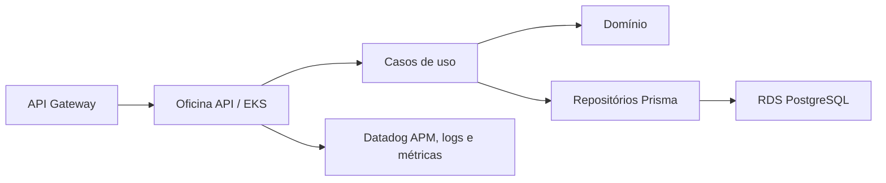

# Oficina API

Aplicação principal da oficina, executada no Amazon EKS. Este repositório contém
o domínio, casos de uso, API HTTP, Prisma, migrations, testes e imagem Docker.

## Tecnologias

- Node.js 22, TypeScript e Express;
- PostgreSQL, Prisma e migrations;
- Jest, ESLint e Swagger/OpenAPI;
- Docker e Kubernetes;
- Datadog APM/logs (a implementar na etapa de observabilidade).

## Execução local

```bash
npm ci
npm run prisma:generate
docker compose up -d
```

Swagger local: http://localhost:3000/docs/

## Validações

```bash
npm run lint
npm run typecheck
npm test
npm run build
```

## CI/CD

O workflow inicial valida a aplicação em Pull Requests e pushes. O CD para EKS
será acrescentado após a infraestrutura cloud disponibilizar cluster, ECR,
roles OIDC e nomes dos environments.

## Arquitetura



As definições completas estão em `docs/fase3/`.

