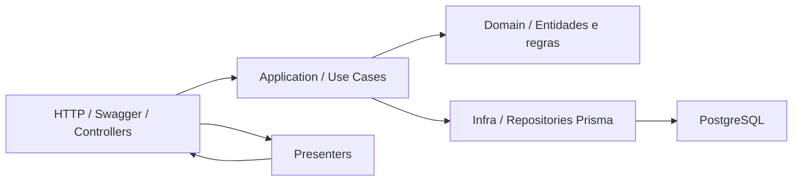
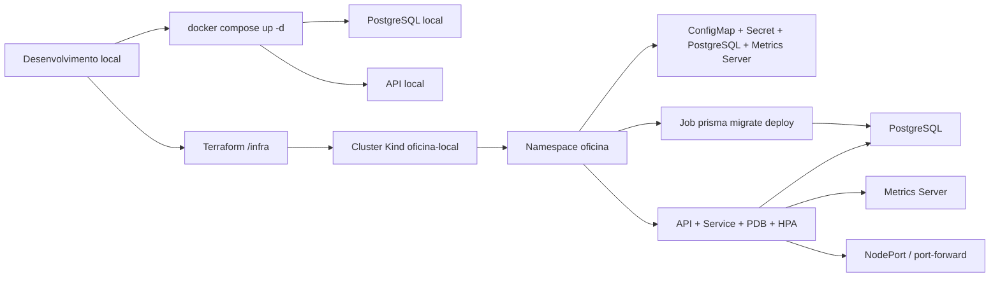

# Arquitetura

## Visão geral

A solução combina uma API Node.js em Clean Architecture com infraestrutura declarativa em Docker Compose, Kubernetes, Terraform e GitHub Actions.

## Componentes da aplicação

## Desenho da infraestrutura

## Fluxo de branches e deploy

```mermaid
flowchart LR
  Feat["feature/*"] --> CI1["ci-feature.yml"]
  CI1 --> PRD["PR para develop"]
  PRD --> DEV["develop"]
  DEV --> CIC["CI completo"]
  CIC --> PRH["PR para homolog"]
  PRH --> HOM["homolog"]
  HOM --> CIH["CI completo"]
  CIH --> PRM["PR para main"]
  PRM --> MAIN["main"]
  MAIN --> CD["CD em Kind efêmero"]
```

## Pontos de leitura

- O Compose resolve a execução local simples com API + banco.
- O Terraform provisiona o cluster Kind e aplica os manifests como resources.
- O GitHub Actions valida as branches em etapas e cria a próxima PR quando tudo passa.
- O CD é disparado por `workflow_run` depois do CI da `main`.
- O Job de migração roda separado da API e antes do deploy final da aplicação.
- O HPA escala apenas a API, porque ela é a borda stateless da solução.
- O PostgreSQL roda como recurso separado no cluster para manter o fluxo reproduzível.
- A API é exposta via `port-forward` na demo, com `NodePort` opcional apenas quando houver `extraPortMappings` no Kind.

