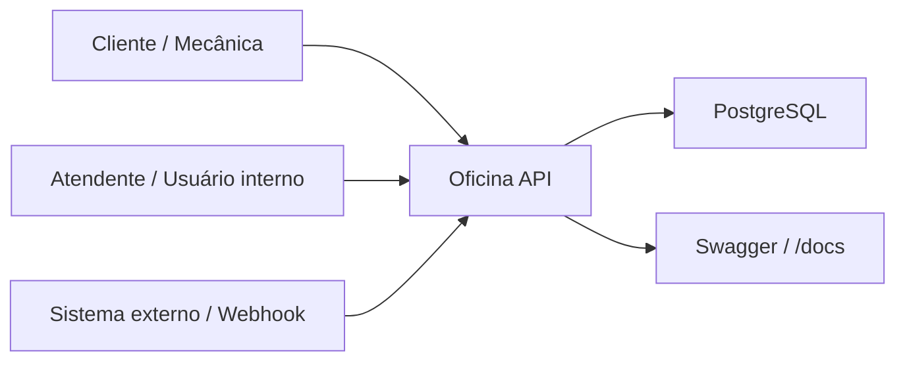
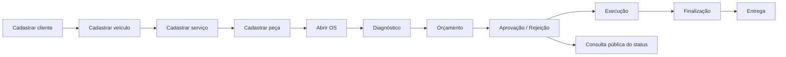
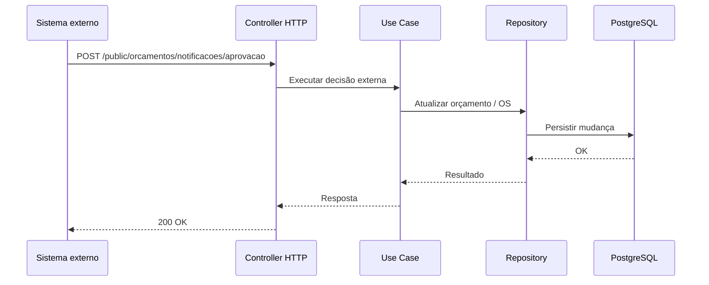
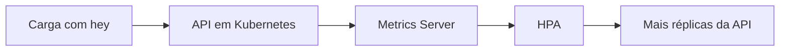

# Desenhos adicionais

Este arquivo complementa `app/docs/arquitetura.md`

## 1. Contexto da solução

## 2. Fluxo funcional da ordem de serviço

## 3. Atualização externa de orçamento

## 4. Escalabilidade com HPA

