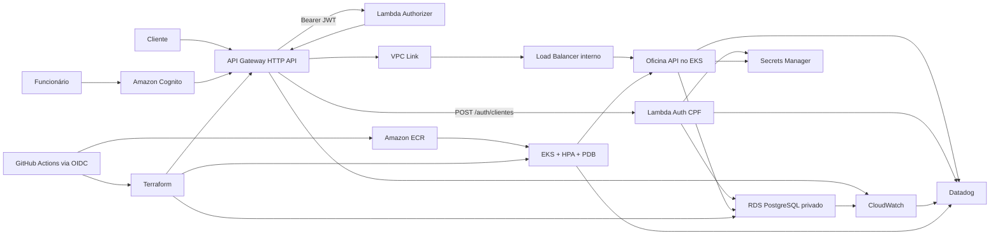
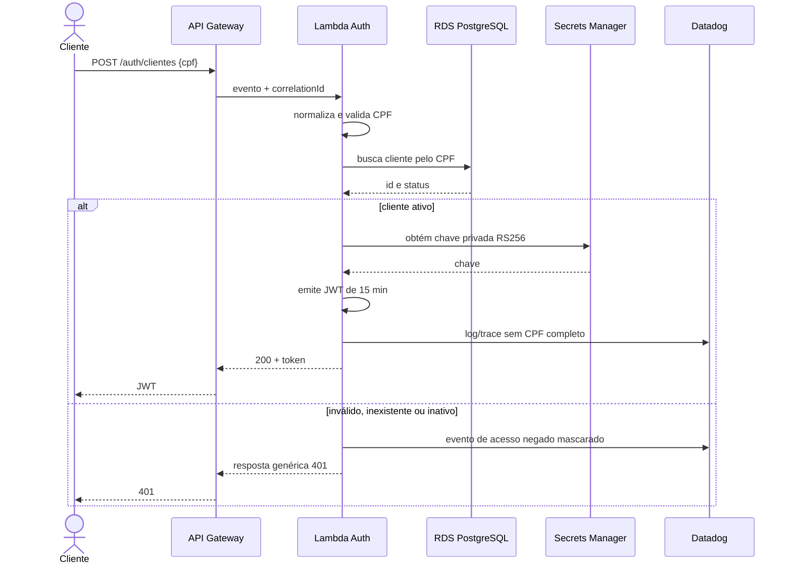
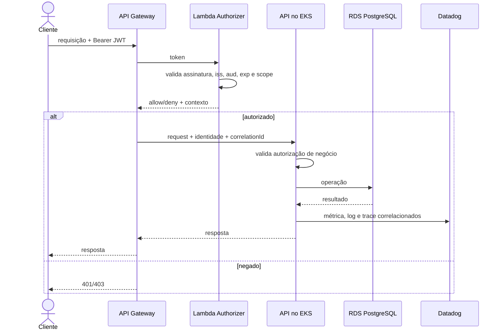

# Arquitetura-alvo da Fase 3

## Componentes



O mesmo desenho existe nas contas de homologação e produção, sem banco,
segredos ou estado Terraform compartilhados.

## Sequência de autenticação do cliente



## Sequência de API protegida



## Fronteiras dos quatro repositórios

| Repositório | Responsabilidade principal |
|---|---|
| `oficina-auth-function` | Lambda de CPF, Authorizer e infraestrutura serverless/API Gateway acordada |
| `oficina-k8s-infra` | VPC/EKS, nodes, addons, HPA e base Kubernetes |
| `oficina-database-infra` | RDS, subnets, Security Groups, backups e secrets do banco |
| `oficina-api` | código da API, imagem, migrations, manifests/Helm e deploy da aplicação |

Dependências entre repositórios devem ocorrer por outputs publicados e
parâmetros/segredos bem definidos, nunca por cópia manual de credenciais.

## Naming e tags

Formato de nomes:

```text
oficina-<componente>-<ambiente>-<regiao>
```

Exemplos:

```text
oficina-eks-hml-us-east-1
oficina-db-prod-us-east-1
oficina-auth-hml-us-east-1
```

Tags obrigatórias:

| Tag | Valor/exemplo |
|---|---|
| `Project` | `techchallenge-oficina` |
| `Environment` | `hml` ou `prod` |
| `ManagedBy` | `terraform` |
| `Owner` | nome/identificador do grupo |
| `CostCenter` | `fiap-fase3` |
| `Repository` | nome do repositório responsável |
| `DataClassification` | `personal` quando alcançar dados de cliente |
| `ExpiresAt` | data de remoção do recurso acadêmico, quando aplicável |

