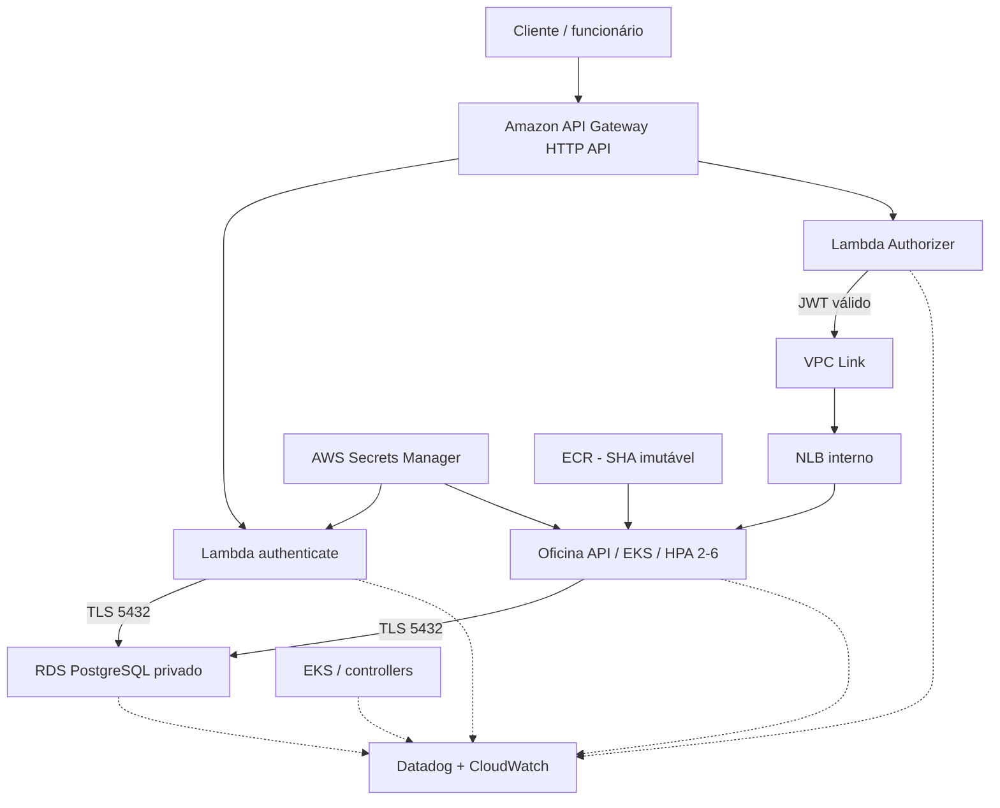
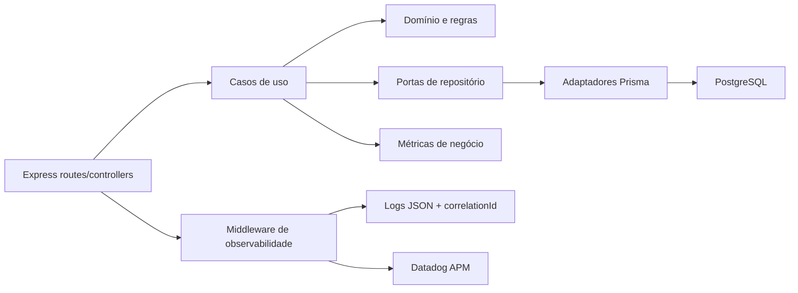
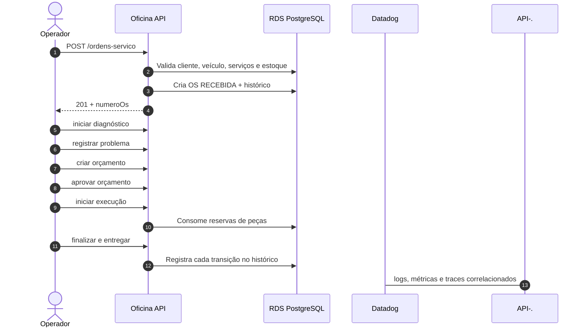

# Entrega técnica da Fase 3

## Objetivo da solução

A solução digitaliza o fluxo de uma oficina mecânica: clientes e veículos, catálogo e estoque, abertura e acompanhamento de ordem de serviço, diagnóstico, orçamento, aprovação, execução, finalização, entrega e indicadores de tempo.

Na Fase 3, o objetivo arquitetural foi transformar a aplicação em uma solução cloud distribuída, com componentes independentes, autenticação serverless, Kubernetes gerenciado, banco privado, CI/CD e observabilidade ponta a ponta.

## Mapa geral da arquitetura entregue

## Repositórios e responsabilidades

| Repositório | Objetivo | Artefatos principais |
|---|---|---|
| [`oficina-api`](https://github.com/maypinheiro/oficina-api) | Regras de negócio e API HTTP | TypeScript/Express, Prisma, testes, Dockerfile, Swagger |
| [`oficina-auth-function`](https://github.com/maypinheiro/oficina-auth-function) | Autenticação de clientes e autorização do Gateway | Lambdas, JWT RS256, API Gateway, VPC Link, Terraform |
| [`oficina-k8s-infra`](https://github.com/maypinheiro/oficina-k8s-infra) | Plataforma Kubernetes e observabilidade | VPC, EKS, ECR, manifests, HPA/PDB, Datadog |
| [`oficina-database-infra`](https://github.com/maypinheiro/oficina-database-infra) | Persistência gerenciada | RDS PostgreSQL, SG, Secrets Manager, backups, alarmes |

## Mapa interno da API

Os contextos de clientes, catálogo, estoque, atendimento, orçamento e métricas mantêm regras no domínio/aplicação; Express e Prisma são detalhes externos. Essa separação facilita testes unitários e substituição de adaptadores.

## Fluxo de abertura e conclusão da OS

## Decisões técnicas consolidadas

### AWS e ambientes

AWS foi escolhida pela aderência a EKS, Lambda, API Gateway, RDS, Secrets Manager e integração Datadog. `hml` recebe a branch `homolog`; `prod` recebe `main` mediante aprovação. States, namespaces, nomes, tags, secrets e bancos são isolados.

### Banco gerenciado

PostgreSQL foi movido para RDS privado. A aplicação e a Lambda acessam a porta 5432 somente por Security Groups autorizados e TLS com CA da AWS. Migrations continuam pertencendo à API e são executadas por Job antes do rollout.

### Autenticação e autorização

Cliente autentica por CPF conforme o requisito acadêmico. Lambda consulta apenas cliente `ATIVO` e emite JWT RS256 de curta duração. Lambda Authorizer valida o token no Gateway. O login administrativo legado permanece separado; Cognito é evolução, não parte já implantada.

### Kubernetes e escalabilidade

A API stateless roda no EKS com duas réplicas, PDB, rolling update, probes e HPA até seis pods. O banco e as Functions não são colocados sob HPA.

### Observabilidade

Datadog centraliza APM, métricas, logs e dashboards. CloudWatch mantém sinais nativos de Gateway, Lambda e RDS. `correlationId`, `traceId`, `service`, `env` e `version` permitem cruzar os eventos. Dados sensíveis são filtrados.

### Entrega contínua

CI valida lint, tipos, testes, cobertura, integração, segurança, build e IaC. Imagens ECR usam SHA imutável. CD executa migration, rollout e smoke tests. Promoções usam PRs entre `develop`, `homolog` e `main`.

## Requisitos atendidos

- API e banco implantados em cloud com PostgreSQL gerenciado.
- Kubernetes gerenciado com HPA e alta disponibilidade básica.
- Function serverless para autenticação por CPF e emissão de JWT.
- API Gateway com Lambda Authorizer e integração privada.
- CI/CD, qualidade, segurança e rollback documentados.
- Logs JSON, métricas, traces, dashboards e monitores Datadog.
- RFCs, ADRs, arquitetura de componentes e sequências.
- Quatro repositórios públicos com responsabilidades separadas.

Para evitar que esta visão executiva esconda lacunas, consulte a [matriz de conformidade](matriz-conformidade.md). Ela diferencia requisito implementado, evidência executada e ação ainda pendente. Na auditoria de 11/09/2026, a principal lacuna técnica encontrada foi o gatilho manual dos workflows de CD; vídeo, evidência visual de HPA/Datadog e URL no PDF também dependem de conclusão.

## Limitações e transparência acadêmica

A conta `982623100545` é um AWS Academy Learner Lab. Credenciais STS expiram, `LabRole` restringe IAM e alguns serviços, e recursos podem ser interrompidos ao final da sessão. Por isso:

- credenciais nunca são versionadas e precisam ser renovadas nos GitHub Environments;
- controllers do cluster que acessam AWS também precisam receber a sessão atual;
- homologação concentra a evidência executada;
- produção está codificada e isolada, mas depende de saldo/permissões para ser criada;
- Cognito, OIDC/IRSA pleno e Multi-AZ de produção são evoluções condicionadas ao laboratório.

## Evidências atuais

- EKS e controllers: <https://github.com/maypinheiro/oficina-k8s-infra/actions/runs/34616729840>
- JWT, Authorizer, Gateway, VPC Link, NLB e rota protegida: <https://github.com/maypinheiro/oficina-auth-function/actions/runs/34617351925>
- Endpoint de homologação: <https://9o7vnq3io0.execute-api.us-east-1.amazonaws.com>
- Swagger de homologação: <https://9o7vnq3io0.execute-api.us-east-1.amazonaws.com/docs>
- Dashboard da API: <https://app.datadoghq.com/dashboard/uhc-x7j-d3i>
- Dashboard Kubernetes: <https://app.datadoghq.com/dashboard/cfp-bd3-ayn>
- Dashboard de negócio: <https://app.datadoghq.com/dashboard/i9b-paf-7z5>
- Proteção de `main` e `soat-architecture`: confirmados nos quatro repositórios pela API do GitHub em 11/09/2026.

O endpoint depende de uma sessão ativa do Learner Lab e pode não responder fora da janela acadêmica.

## Índice de decisões e operação

- [RFCs, ADRs e documentos da Fase 3](README.md)
- [Arquitetura-alvo e sequências](arquitetura-alvo.md)
- [Matriz de rotas e permissões](matriz-rotas-permissoes.md)
- [Modelo de dados](modelo-dados.md)
- [Observabilidade](observabilidade.md)
- [Segurança](seguranca.md)
- [Runbook](runbook.md)
- [Estimativa de custos](estimativa-custos.md)
- [Roteiro do vídeo](roteiro-video-final.md)
- [Entrega final](entrega-final.md)
- [Matriz de conformidade](matriz-conformidade.md)
- [Catálogo de evidências](catalogo-evidencias.md)
- [Guia de demonstração e aceite](guia-demonstracao-e-aceite.md)
