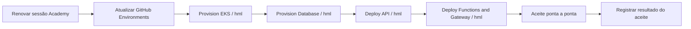

# Guia de aceite técnico reproduzível

Este guia permite repetir a validação da solução. O vídeo final já foi gravado;
portanto, o documento não funciona como um segundo roteiro de apresentação.

## Preparação segura

1. Inicie uma sessão nova no AWS Academy Learner Lab.
2. Atualize `AWS_ACCESS_KEY_ID`, `AWS_SECRET_ACCESS_KEY` e `AWS_SESSION_TOKEN` nos environments necessários dos quatro repositórios.
3. Nunca compartilhe a tela da página de secrets, do terminal com variáveis ou do JSON de credenciais.
4. Execute primeiro `Provision EKS` para renovar também as credenciais dos controllers dentro do cluster.
5. Confirme `/health`, Swagger e os três dashboards antes do aceite.

## Ordem operacional



## Roteiro de aceite funcional

| Cenário | Resultado esperado | Evidência a capturar |
|---|---|---|
| `GET /health` | HTTP 200 | URL e corpo sem dados sensíveis |
| CPF válido/ativo | HTTP 200 e token Bearer | Mostrar existência do campo, não o conteúdo integral |
| CPF estruturalmente inválido | HTTP 400 | Mensagem genérica de CPF inválido |
| CPF válido inexistente | HTTP 401 | `Acesso nao autorizado` |
| Cliente inativo/bloqueado | HTTP 401 | Mesma resposta do inexistente para evitar enumeração |
| Rota protegida sem JWT | HTTP 401/403 | Negação do Gateway |
| Rota protegida com JWT | HTTP 200 | Lista/objeto retornado |
| Abrir OS | HTTP 201, status `RECEBIDA` | Número da OS e primeiro item do histórico |
| Diagnóstico | Status `EM_DIAGNOSTICO` | Histórico atualizado |
| Problema/orçamento | `AGUARDANDO_APROVACAO` | Itens e total calculado |
| Aprovação | Status de orçamento aprovado | Reserva de estoque |
| Execução | `EM_EXECUCAO` | Consumo/reserva coerente |
| Finalização | `FINALIZADA` | Data e histórico |
| Entrega | `ENTREGUE` | Estado terminal |

## Correlação e observabilidade

Envie `x-correlation-id: demo-fase3-<data>` em uma chamada protegida. No Datadog:

1. filtre logs por esse valor;
2. confirme JSON com `service`, `env`, rota, status e duração;
3. abra o trace associado e mostre spans HTTP/PostgreSQL;
4. confirme que CPF completo, JWT e credenciais não aparecem;
5. mostre a mesma janela temporal nos dashboards.

Links: [API](https://app.datadoghq.com/dashboard/uhc-x7j-d3i), [Kubernetes](https://app.datadoghq.com/dashboard/cfp-bd3-ayn) e [Negócio](https://app.datadoghq.com/dashboard/i9b-paf-7z5).

## Falha controlada e alerta

Tente uma transição inválida de OS, como finalizar antes de iniciar a execução. O resultado esperado é erro de regra de negócio, incremento de `oficina.os.operation_errors`, log JSON correlacionado e ativação do monitor de falhas de OS. Não derrube banco, cluster ou recursos compartilhados para produzir a demonstração.

## Demonstração do HPA

Antes da carga:

```bash
kubectl get hpa,pods -n oficina-hml
kubectl top pods -n oficina-hml
```

Gere carga repetida contra uma rota de leitura e acompanhe:

```bash
kubectl get hpa,pods -n oficina-hml -w
```

Capture utilização acima do alvo, `DESIRED` maior que 2 e novos pods prontos. O HPA pode não subir se a rota for leve; nesse caso aumente concorrência e duração, sem remover os limites de segurança. Ao finalizar, interrompa a carga e mostre a estabilização.

## Controles de segurança e submissão

- Não exibir CPF completo, JWT, chaves, AWS secrets ou Datadog API key.
- Mostrar URL/nome do recurso e status, não valores sensíveis.
- Usar dados sintéticos.
- Vídeo informado como validado e disponível no link da entrega final.
- Inserir a versão atual da documentação no PDF e conferir todos os links antes do Portal do Aluno.
