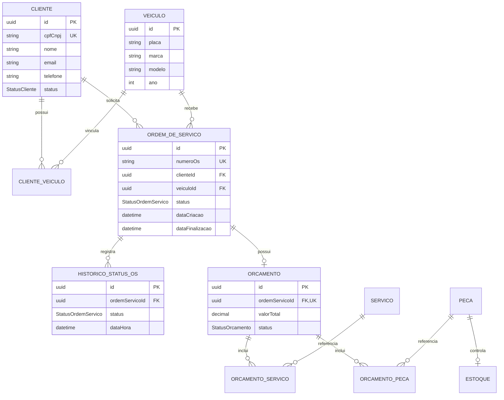

# Modelo de dados da Fase 3

## Decisão

O PostgreSQL foi mantido por oferecer integridade referencial, transações e boa
aderência ao domínio relacional da oficina. Na nuvem, ele será executado no
Amazon RDS, removendo da equipe a administração de servidor, storage e backups.

## Ajustes desta etapa

- `Cliente.status` identifica clientes `ATIVO`, `INATIVO` ou `BLOQUEADO`;
- todo cliente existente migra como `ATIVO`, preservando compatibilidade;
- novos clientes recebem `ATIVO` por padrão no banco;
- a API administrativa pode alterar o status;
- índices de status e datas sustentam autenticação e dashboards;
- índices de placa, serviço e peça sustentam consultas operacionais;
- histórico de status mantém a base para calcular duração de cada etapa da OS.

## Diagrama ER

## Índices e finalidade

| Índice | Finalidade |
|---|---|
| `Cliente(cpfCnpj)` único | autenticação e prevenção de duplicidade |
| `Cliente(status)` | filtragem/auditoria de clientes autorizáveis |
| `Veiculo(placa)` | busca operacional por placa |
| `Servico(nome)` e `Peca(nome)` | montagem de orçamento e estoque |
| `OrdemDeServico(status, dataCriacao)` | fila e volume diário por status |
| `OrdemDeServico(clienteId, dataCriacao)` | histórico cronológico do cliente |
| `HistoricoStatusOS(ordemServicoId, dataHora)` | timeline e duração por etapa |
| `HistoricoStatusOS(status, dataHora)` | agregações dos dashboards |

## Integridade e segurança

- CPF/CNPJ e número da OS permanecem únicos;
- vínculos e ordens usam foreign keys com exclusão restrita;
- orçamento continua um-para-um com a OS;
- valores monetários usam `Decimal(10,2)`;
- desativação lógica pelo status é preferida à exclusão de cliente com histórico;
- a Function de autenticação consultará apenas ID e status após localizar o CPF;
- CPF completo não será incluído em logs ou claims do JWT.

## Limitação registrada

O campo legado se chama `cpfCnpj`, enquanto a autenticação exigida é por CPF.
A Function rejeitará documentos com tamanho diferente de 11 dígitos. A eventual
separação entre pessoa física e jurídica deverá ser tratada em evolução futura,
sem migração destrutiva durante a Fase 3.
